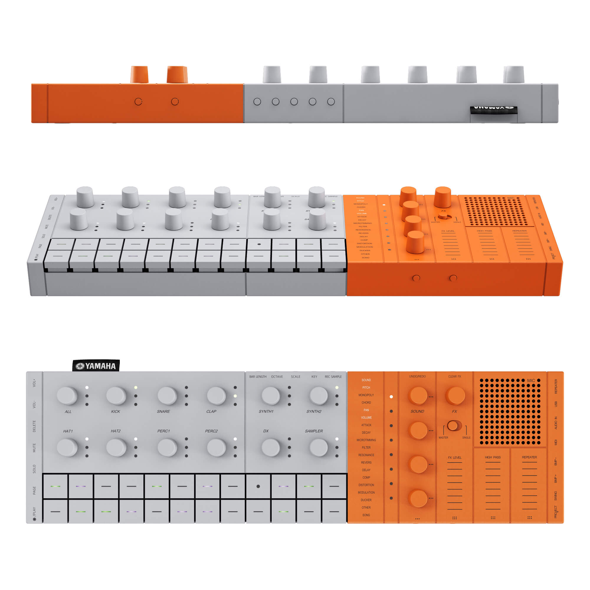

# SeqTrack Composer

**AI-powered music composition and performance tool for the Yamaha SEQTRAK groovebox.**

Describe music in natural language, get step-sequencer patterns across 11 tracks, edit them visually in a piano-roll editor, and send MIDI directly to your SEQTRAK over USB -- all from a native desktop app.




---

## Features

### AI Composition (`/compose`)

Natural language to MIDI patterns. Describe a groove, genre, mood, or reference track and get a complete multi-track arrangement for all 11 SEQTRAK channels.

- **5 LLM providers**: Claude (Anthropic), Gemini (Google), OpenRouter (300+ models), LM Studio (local), Ollama (local)
- **Genre presets**: 20+ categorized starting points -- full beats, melodic, full production, drums only, bass only
- **Prompt enhancement**: AI rewrites vague prompts into detailed musical instructions before generation
- **Iterative refinement**: Generate, preview, refine with follow-up instructions, then apply to editor
- **Generation history**: Browse and restore previous compositions
- **Sound-aware generation**: AI receives the full 2032-preset sound catalog and recommends specific SEQTRAK sounds per track

### Step Sequencer Editor (`/editor`)

Visual 11-track step grid with per-step note editing, inline sound selection, and live playback.

- **7 drum channels** (Kick, Snare, Clap, Hat 1, Hat 2, Perc 1, Perc 2): single-row click-to-toggle at fixed pitch 60
- **4 melodic channels** (Synth 1, Synth 2, DX, Sampler): expandable piano roll with configurable octave range
- **Scale-aware harmony hints**: consonant/dissonant indicators on hover for melodic tracks
- **Inline sound picker**: browse and audition sounds per track with AI genre-based recommendations
- **Live editing**: add/remove notes, mute/unmute tracks, adjust volume -- all take effect immediately during playback
- **Import dialog**: import from sheet music (PDF/image via Docling + AI vision), MIDI files, drum tabs, bass tabs, or text notation
- **AI Enhance**: improve existing patterns with ghost notes, fills, swing, humanization, and sound optimization

### Sound Browser (`/sounds`)

Browse, audition, and control all 2032+ SEQTRAK sound presets.

- **Engine tabs**: Drum (AWM2), Synth (AWM2), DX (FM synthesis), Sampler
- **Category filtering**: filter by sound type within each engine
- **SysEx device scanner**: read the actual preset names from your connected SEQTRAK hardware
- **Real-time CC control**: adjust parameters per track -- vibrato, reverb, resonance, cutoff, and 30+ others from the SEQTRAK Data List V2.00
- **Sound preview**: click any preset to send it to the connected device

### Hand Tracking Performance (`/perform`)

Map hand gestures to MIDI CC parameters for real-time sound manipulation via webcam.

- **MediaPipe hand tracking**: recognize hand landmarks and gestures at 30+ fps
- **Configurable CC mappings**: assign hand movements (pinch, fist, wrist rotation, distance) to any CC parameter on any channel
- **Preset mapping profiles**: load pre-built gesture-to-FX configurations
- **Output monitor**: real-time visualization of CC values being sent
- **FX reset**: one-click return all mapped parameters to defaults

### Audio Import & Transcription

Multiple import paths from external music into SEQTRAK-compatible patterns.

- **Sheet music import**: upload PDF or image files, processed via Docling document conversion and AI vision
- **MIDI file import**: drag-and-drop standard MIDI files with automatic channel mapping
- **Drum tab / Bass tab import**: paste tablature notation and convert to step-sequencer patterns
- **Text notation import**: describe notes in plain text for AI conversion
- **Audio transcription** (requires ML service): upload audio files or paste URLs, HTDemucs 6-stem separation, Basic Pitch MIDI transcription, AI analysis with 3 output options (faithful/simplified/creative)

### Session Recording (`/sessions`)

Record live MIDI performance sessions with audio capture.

- **MIDI event recording**: capture note-on, note-off, CC, and program change events with precise timestamps
- **Audio capture**: record the audio output alongside MIDI events
- **Session browser**: list, sort, and manage saved recording sessions
- **IndexedDB storage**: sessions stored locally in the browser database

### Device Management (`/device`)

Connect to your SEQTRAK and verify communication.

- **Auto-detect**: scans for SEQTRAK via Web MIDI API on page load
- **SysEx enabled**: full parameter access for sound scanning and deep control
- **Per-channel test**: send test notes on each of the 11 channels to verify connectivity
- **Connection status**: persistent indicator in the app header

### Project Management (`/projects`)

Save, load, and export your work.

- **localStorage persistence**: all project state saved automatically, no server or database required
- **MIDI export**: download any project as a Standard MIDI File (.mid, Type 1) with all 11 tracks
- **JSON backup**: export/import settings as JSON for backup or transfer between machines

### Settings (`/settings`)

Configure every aspect of the application.

- **AI & Models**: switch between 5 LLM providers, select specific models, adjust temperature and max tokens
- **Composition defaults**: default BPM, key, scale, bars, swing, auto-melodic generation toggle
- **Editor preferences**: piano roll octave range, harmony hints, grid size, auto-play behavior
- **Transcription**: ML service URL, Demucs stem model selection, BPM auto-detection
- **Audio & MIDI**: playback mode (device/internal/both), monitor volume
- **Storage & data**: usage indicator, selective clearing, settings export/import
- **All settings persist in localStorage** and survive app restarts; exportable as JSON for backup

---

## SEQTRAK Channel Map

The SEQTRAK does **not** follow General MIDI conventions. Each drum instrument has its own dedicated channel.

| Channel | Track    | Type    | Engine     |
|---------|----------|---------|------------|
| 1       | Kick     | Drum    | AWM2 Drum  |
| 2       | Snare    | Drum    | AWM2 Drum  |
| 3       | Clap     | Drum    | AWM2 Drum  |
| 4       | Hat 1    | Drum    | AWM2 Drum  |
| 5       | Hat 2    | Drum    | AWM2 Drum  |
| 6       | Perc 1   | Drum    | AWM2 Drum  |
| 7       | Perc 2   | Drum    | AWM2 Drum  |
| 8       | Synth 1  | Melodic | AWM2 Synth |
| 9       | Synth 2  | Melodic | AWM2 Synth |
| 10      | DX       | Melodic | FM Synth   |
| 11      | Sampler  | Melodic | Sampler    |

Drum tracks use fixed pitch 60 (C3). Melodic tracks use real MIDI note numbers within the selected scale. 16 steps per bar (16th notes), 1-8 bars per pattern (max 128 steps).

---

## Getting Started

### Prerequisites

- **Node.js 22+**
- **Yamaha SEQTRAK** connected via USB (optional -- the app works without hardware for composition and editing)
- **Chrome or Edge** (if running as web app -- Web MIDI API required)

### Setup

```bash
git clone <repo-url>
cd seqtrack-composer
npm install
```

Create `.env.local` with your API key:

```
ANTHROPIC_API_KEY=sk-ant-...
```

Or skip this and configure your preferred LLM provider in Settings after launch.

### Run as Web App

```bash
npm run dev
```

Open http://localhost:3000 in Chrome or Edge.

### Run as Desktop App (Electron)

```bash
npm run electron:dev
```

This starts Next.js on port 3000 and opens Electron once the server is ready. MIDI and camera permissions are auto-granted (no browser prompts).

---

## Desktop App (Electron)

SeqTrack Composer runs as a native macOS desktop app via Electron 35 with an embedded Next.js server.

### Build Commands

| Command                      | Output                               |
|------------------------------|--------------------------------------|
| `npm run electron:dev`       | Dev mode (Next.js + Electron)        |
| `npm run electron:build`     | Production `.dmg` for ARM64 (Apple Silicon) |
| `npm run electron:build:universal` | Universal binary (ARM64 + x64) |

Built artifacts are written to the `release/` directory.

### macOS Optimizations

On Apple Silicon (M3, M2, M1), the Electron main process enables:

- **Metal ANGLE backend** -- native GPU rendering, bypasses OpenGL translation
- **SkiaGraphite** -- next-generation Skia rendering backend built on Metal
- **Zero-copy textures** -- leverages unified memory architecture
- **IOSurface compositing** -- macOS-native GPU memory primitives
- **Canvas OOP rasterization** -- offloads Canvas 2D to GPU process
- **Background throttling disabled** -- keeps the timing worker at full speed for accurate MIDI playback

### Electron Features

- Hidden title bar with native macOS traffic lights
- Auto-granted MIDI, SysEx, and camera permissions
- MIDI panic (All Notes Off) sent on app quit to prevent stuck notes
- External links open in the default browser

---

## LLM Provider Setup

Configure in **Settings > AI & Models** or via environment variables.

| Provider     | Configuration                          | Models                                                    |
|--------------|----------------------------------------|-----------------------------------------------------------|
| **Claude**   | `ANTHROPIC_API_KEY` in `.env.local`    | Opus 4.6, Sonnet 4.6 (default), Sonnet 4, Haiku 4.5      |
| **Gemini**   | API key in Settings UI                 | 2.5 Pro, 2.5 Flash (default), 2.5 Flash-Lite, 3.1 Pro Preview, 3 Flash Preview |
| **OpenRouter** | API key in Settings UI or `OPENROUTER_API_KEY` in `.env.local` | 300+ models -- live browsing with search and popular picks |
| **LM Studio** | URL in Settings UI (default `http://localhost:1234/v1`) | Any locally loaded model -- auto-detected from LM Studio  |
| **Ollama**     | URL in Settings UI (default `http://localhost:11434`)   | Any locally pulled model -- auto-detected from Ollama      |

Claude and Gemini support native structured output (Zod schema validation). OpenRouter, LM Studio, and Ollama use a JSON fallback parser with normalization.

---

## Architecture

```
src/
  app/
    (app)/           Route group with shared AppShell layout
      compose/       AI composition page
      editor/        Step sequencer + piano roll
      sounds/        Sound browser + CC control
      perform/       Hand tracking performance
      sessions/      Recording session browser
      device/        MIDI device management
      projects/      Project save/load/export
      settings/      App configuration
    api/
      compose/       POST — AI pattern generation
      enhance/       POST — AI pattern enhancement
      enhance-prompt/ POST — prompt rewriting
      import-sheet/  POST — sheet music import
      transcribe/    POST — audio transcription
      models/        GET — LM Studio / Ollama model list
      openrouter-models/ GET — OpenRouter model catalog
  components/        UI components (editor, compose, perform, layout, shadcn)
  hooks/             React hooks (MIDI connection, sound control, compose, recording, etc.)
  lib/
    ai/              Prompts, schemas, model provider, JSON fallback
    midi/            Types, constants, pattern generators, MIDI export, SysEx, sound library
    webmidi/         Device I/O via WebMidi.js (connection, sender, input listener)
    audio/           Audio monitoring and analysis
    recording/       Session recording types and logic
    import/          MIDI/tab/notation import utilities
    storage/         IndexedDB for session persistence
    handtracking/    MediaPipe integration
  providers/         React context (ProjectProvider, TransportProvider, MidiConnectionProvider)
  stores/            Zustand stores
electron/
  main.js            Electron main process (Next.js server, window, permissions)
  preload.js         Context bridge for IPC
```

**Key design decisions:**

- **ProjectProvider** (React context) holds the active project and selected channel. All state mutations flow through it.
- All pattern manipulation functions in `src/lib/midi/` are **pure** -- they return new objects, never mutate.
- WebMidi.js is **dynamically imported** everywhere because it accesses `navigator` and cannot run server-side.
- AI composition uses **AI SDK v6** with Zod-validated structured output (`generateText` + `Output.object()`).
- No database. All state lives in **localStorage** (projects, settings) and **IndexedDB** (recording sessions).

---

## Tech Stack

| Layer          | Technology                                       |
|----------------|--------------------------------------------------|
| Framework      | Next.js 16 (App Router)                          |
| Desktop        | Electron 35 + electron-builder 25                |
| AI             | AI SDK v6, @ai-sdk/anthropic, @ai-sdk/google, @openrouter/ai-sdk-provider, @ai-sdk/openai-compatible |
| UI             | shadcn/ui 4, Tailwind CSS 4, Lucide icons        |
| MIDI I/O       | WebMidi.js 3 (with SysEx)                        |
| MIDI Export    | midi-writer-js, @tonejs/midi                     |
| Hand Tracking  | @mediapipe/tasks-vision                          |
| State          | React Context, Zustand 5                         |
| Validation     | Zod 4                                            |
| Language       | TypeScript 5, React 19                           |

---

## Build Commands

```bash
npm run dev                    # Next.js dev server (port 3000)
npm run build                  # Next.js production build
npm run start                  # Serve production build
npm run lint                   # ESLint
npm run electron:dev           # Electron + Next.js dev mode
npm run electron:build         # macOS ARM64 .dmg
npm run electron:build:universal  # macOS universal .dmg
```

---

## License

Copyright 2024-2026. All rights reserved.
